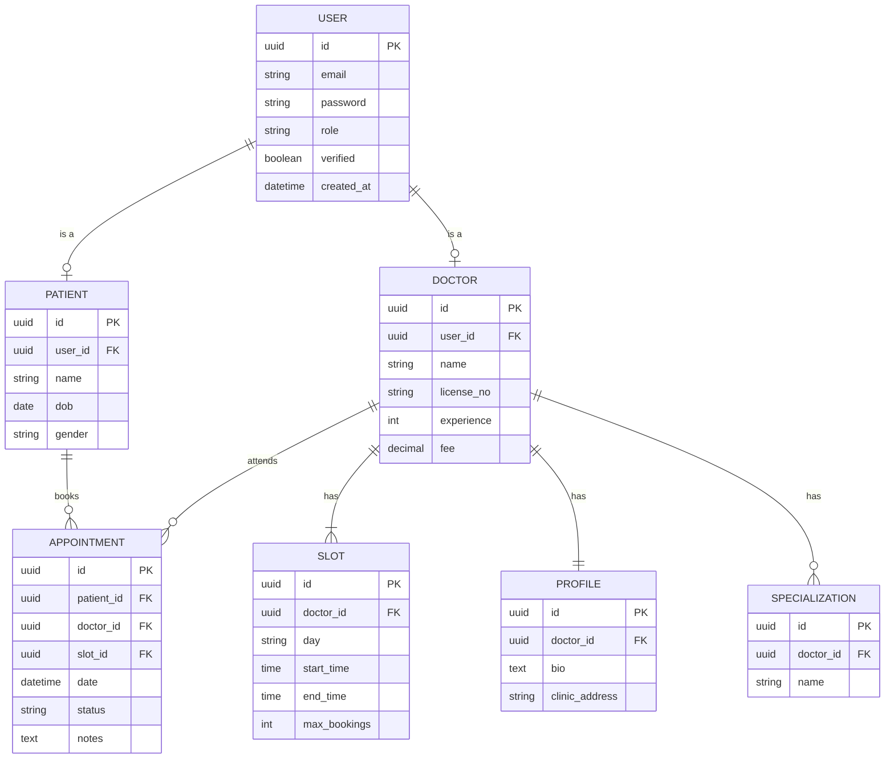

# ER Diagram - Doctor Patient System

## Entities

## Relationships

- User can be Patient or Doctor (role based)
- Doctor has Profile (1:1)
- Doctor has multiple Slots
- Doctor has multiple Specializations
- Patient books Appointments
- Doctor attends Appointments
